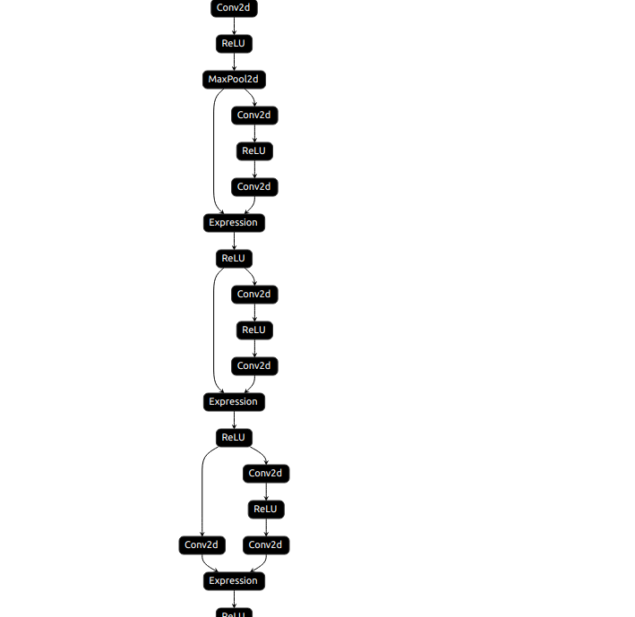
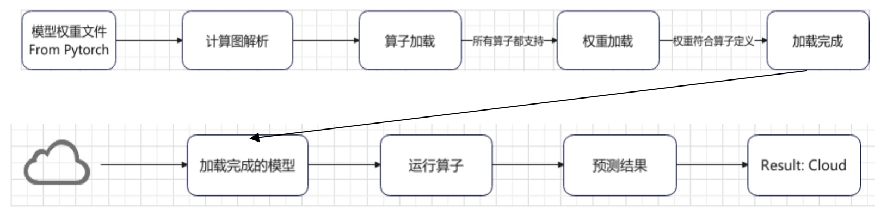
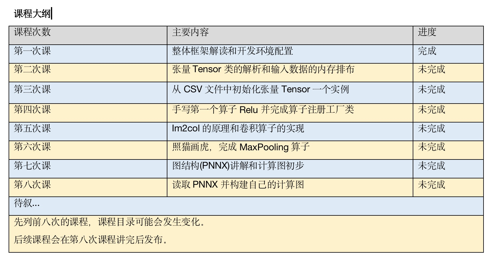

## 整体框架解读和开发环境配置

深度学习推理框架用于对已训练完成的神经网络进行预测，也就是说，能够将深度训练框架例如Pytorch、Tensorflow中定义的算法移植到中心侧和端侧，并高效执行。与训练框架不同的是，深度学习推理框架没有梯度反向传播功能，因为算法模型文件中的权重系数已经被固化，推理框架只需要读取、加载并完成对新数据的预测即可。

### 模型加载阶段

训练完成的模型被放置在两个文件中，一个是模型定义文件，一个是权重文件。

**模型定义文件和计算图**

模型定义文件由多个节点的定义和节点之间的数据流图组成，节点定义包括模型中各节点的参数，例如在卷积算子中的参数，就包括了卷积核的大小，步长以及输入输出特征图的尺寸大小等，节点根据模型文件中的参数进行构建。数据流图阐述了节点之间数据流动的前后顺序和依赖关系。所有节点在根据模型文件中的定义初始化完毕之后，根据数据流图对他们进行一一串联，形成一个有向无环图（DAG），或称为计算图. 这个计算图是少权重的，因为一个只有外壳。

**权重文件** 
在DAG构建完成之后，读取权重文件中各节点的weight和bias数据并依次填充到对应的算子当中。去填充外壳信息，

**输入输出**
输入指的是由图片或者视频帧构建而成的RGB数据，KuiperInfer中数据的输入符合NCHW格式，分别表示批次、通道和高宽。
输出指的是模型对于特定的输入作出的判断，在下图中对于“云层”图像的输出，模型给出的预测为”cloud”类别，至此推理框架完成了一次预测过程。

**整体流程**

近期和远期的打算
1. 完成第一季的课程，共八节
2. 根据第一季的反馈迭代更新第二季的课程，第二季结束能完成ResNet 18的推理
3. 后期可能会出一个关于模型量化的课程，在我们自制推理框架的基础上完成对模型的PTQ量化

本项目的教学方式
1. 不会讲C++基础，默认大家都多少懂C++或者C语言
2. 不会长篇大论地讲，不会手把手地带着敲（毕竟不是编程培训班）
3. 倾向于分模块讲解并以自己动手练习的方式来学习

第一次课程的内容
开发环境
- 开发语言：C++ 17 
- 数学库：Armadillo+OpenBlas
- 加速库：OpenMP，实现算子时候用
- 单元测试：Google Test
- 性能测试：Google Benchmark

主项目代码走读
主项目地址：https://github.com/zjhellofss/KuiperInfer
不要求大家全部掌握，分模块的解读
欢迎大家点赞 star

### 作业
1. git clone https://github.com/zjhellofss/KuiperCourse.git 拉取本次课程的代码
2. git checkout first 切换分支 第一节课程在first 这个branch当中
   
完成自己的测试用例

需要注意的问题：armadillo是列主序的。Y=AxX+bias是一个矩阵相乘问题. armadillo关于矩阵乘和加的文档如下：https://arma.sourceforge.net/docs.html#operators .请按照文档，自行编写test/test_first.cpp中TEST(test_first, linear)的代码来完成上述操作，如果编写正确则通过单元测试，并输出Result Passed!