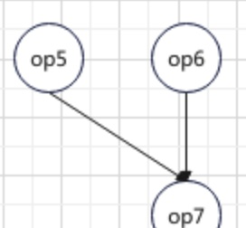

## 算子的执行流程

### 计算图的设计

### Graph的结构
1. Operators: 记录所有的节点
2. Input operator: 指定的输入节点
3. Output operator: 指定的输出节点
4. Global input data: 模型的外部全局输入（用户指定的输入）

### Operator的结构
1. Input data: 节点的输入数据
2. Output data: 节点的输出数据
3. Operator params: 计算节点的参数
4. Next operators: 该节点的下一个节点，数量有且大于一个
5. Layer
6. 每个Operator具体计算的执行者，layer先从input data中取得本层的输入，再通过layer定义的计算过程，并得到output data中
7. 计算的过程中所需要的参数已经被提前存放到Operator params中

### Graph中的数据流动
从下图中可以看出，一个Graph中包含了两个要素，一个是多个operators，另一个是连通operators之间的数据通路。也就是说，前一个operator的输出将作为后一个operator的输入存在，其中在输入和输出中传递的数据，是以前面谈到的Tensor类进行的。

### Graph中的数据流和控制流

可以看到，在图中，Graph在执行时在逻辑上可以分为两条路径，一条是控制流，另外一条是数据流。在数据流中，前一个operator产生的输出传递到后续operator作为输入。

那么Graph是如何得知一个operator的后续operator的？可以看到在前方Operator定义中，有一个变量为Next operators，这个变量记录了一个operator的后继节点。在上图中，可以看到op1有两个后继节点op2和op3，他们也是通过op1.next_oprators得到的。

所以在图的执行中，有两个很重要的部分：
1. 通过op.layer根据输入来进行计算，并得到当前层的输出
2. 将当前层的输出顺利并且正确地传递到后继节点的输入当中。传递的路径是previous.op.output => next.op.input

### 计算图的执行

Q: 对于一个计算图，应该采取怎么样的执行顺序呢？

A: 计算节点的执行是通过广度优先搜索来实现的，当然也有人说这就是一种拓扑排序的实现。

从图中可以看出，现在要执行的图是总共拥有7个op, 分别从op1到op7. 它们之间的前后关系如图中的箭头指向，例如op2, op3, op4均为op1的后继节点，换句话说，只有等到op1执行结束之后,op2, op3, op4才能开始执行，这三个节点的输入也都来自于op3的输出，以下的顺序是上面这个图中的执行顺序。

1. 从graph.input_operator的定义可以知道，op1是开始执行的节点，因此在当前时刻将op1放入到执行队列中
2. op1被从执行队列中取出执行，并得到op1的计算输出，存放到op1.output_data中；同时，根据op1.output_operators定位到op1的后续三个节点，op2, op3和op4, 随后将op1.output_data拷贝到这三个后继节点的输入中 
3. 现在的执行队列存放了三个节点，分别为op2, op3和op4. 随后根据先进先出的顺序取出op2开始执行，因为op2没有后继节点，所以执行完毕后直接开始下一轮迭代
4. 取出队列中的队头op3,在op3执行完毕之后将op3.output_data拷贝到op5.input_data中，并将op5入执行队列 
...... 
随后的执行顺序如图所示，总之也是在一个节点执行完毕之后，通过current_op.output_operators来寻找它的后继节点，并将当前节点的输出拷贝到后继节点的输入中

### 节点执行中的拓扑序

可以看到有这么一种情况，op5和op6都有后继节点为op7, 从执行的顺序上来说，op5会先一步执行，op5会将在本节点的计算输出拷贝到op7.input_data中，但是随后却不能将op7入队列，因为op7的执行输入还依赖于它的另外一个前驱节点op6. 

只有当op6也执行完毕之后，才能将op7入执行队列。从另一个角度“拓扑顺序”来了解这种执行顺序：当一个节点的入度等于0的时候，才能将这个节点放入到执行队列中，当op5和op6都被执行完毕后，op7的入度才是0, 才能进入到执行队列中等待下一步的执行。
