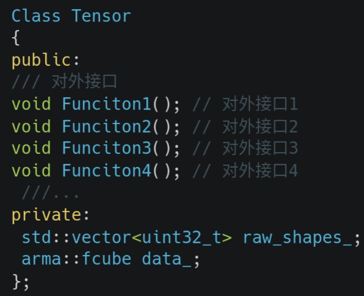
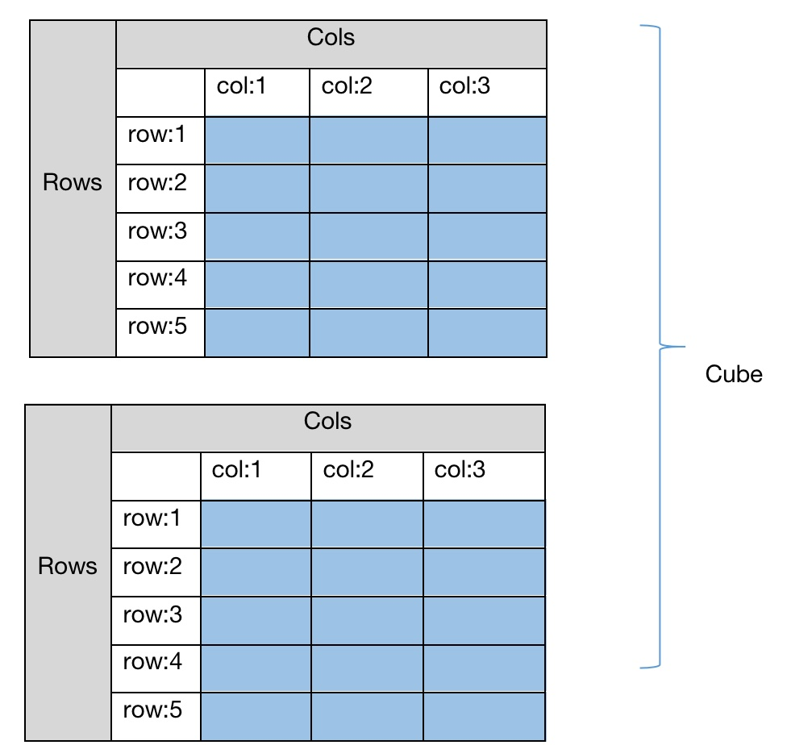
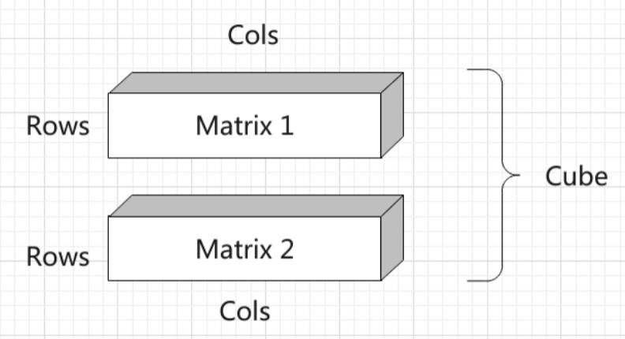
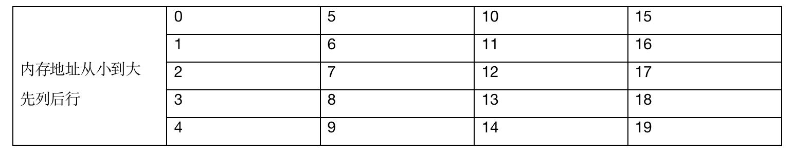

## 张量Tensor类的解析和输入数据的内存排布

### 关于维度的预备知识

在Tensor张量中，共有三维数据进行顺序存放，分别是Channels(维度)，Rows(行高), Cols(行宽)，

三维矩阵我们可以看作多个连续的二维矩阵组成，最简单的方法就是std::vector<std::vector<std::vector<float>>>，但是这种方法非常不利于数据的访问（尤其是内存不连续的问题）、修改以及查询，特别是在扩容的时候非常不方便。

因此，综合考虑灵活性和开发的难易度，我们会以Armadillo类中的`arma::mat`(矩阵 matrix)类和`arma::cube` 作为数据管理(三维矩阵)类来实现Tensor 我们库中类的主体，一个cube由多个matrix组成，cube又是Tensor类中的数据实际管理者。

首先我们讲讲Tensor类和Armadillo中两个类的关系，可以从下图看出Tensor类中的数据均由arma::cube类进行管理扩充。我们设计的类是以arma::cube为基础实现了Tensor类，主要是提供了更方便的访问方式和对外接口。

arma::cube是一个三维矩阵，分别是通道维度(slices或者channels)，行维度(rows)和列维度(cols)，图中是两个5行3列的矩阵，蓝色的区域是数据的实际存储区，灰色和和白色部分仅用作示意，在内存中实际不存在。一个cube类由多个这样的Matrix组成，图1中表示的情况是arma::cube(2,5,3)，表示当前的三维矩阵共有2个矩阵构成，每个矩阵都是5行3列的。如果放在我们项目中会以这形式提供 Tensor tensor(2,5,3)

可以看出一个Cube一共有两个Matrix，也就是共有两个Channel。一个Channel放一个Matrix. Matrix的行宽均为Rows和Cols.

### Tensor类方法总览

在这里对KuiperInfer中Tensor类的方法进行一个总览，其中我们会让大家亲自动手实现两个方法，只有动手起来才能参与其中。
| 类名	| 功能 |
| -- | -- |
|rows()	| 返回Tensor的行数|
|cols()	|返回Tensor的列数|
|Fill(float value)	| 填充Cube中的数据，以value值填充
|Padding()作业	|调整Matrix的维度，让Rows和Cols变大一点|
|at(uint32_t channel, uint32_t row, uint32_t col)|	返回Cube中第channel维，第row行，第col列的数据。|
|index(uint32_t offset) |返回Cube中第offset个数据，比如说在row行，col列，c维的一个数据。tensor.index(c * Rows * Cols + row * Cols + col)|
| Fill(const std::vector<float> &values);作业	|另外一个Fill方法，需要以values中的所有数据去填充Tensor中的数据管理器--cube类，注意values中数据的数量要等于Cube的行数×列数×维度|
|Flatten()	|将三维的矩阵展开铺平为一维的。at接口更适合用来存放展平后的数据。|

### Tensor类模板

Tensor共有两个类型，一个类型是Tensor<float>，另一个类型是Tensor<uint8_t>, Tensor<uint8_t> 可能会在后续的量化课程中进行使用，目前还暂时未实现，在之后的文章中以Tensor来指代Tensor<float>.

### 如何创建一个Tensor

Tensor<float> tensor(3, 5, 3);
可以用一个非常简单的方式来创建一个张量实例，在如上的定义中，得到了一个通道数量为3，行数(rows)为5，列数(cols)为3的tensor变量。

### Tensor类中数据的排布

Tensor类是arma::cube对外更方便的接口，与armadillo::cube管理内存的方式一致。下图中的一个Cube，Cube的维度是2,每个维度上存放的是一个Matrix，一个Matrix中的存储空间被用来存放一张图像。一个channel是一个Matrix，Matrix1 存放在 Cube 第1维度(channel 1)上，Matrix2 存放在 Cube的 第2维度上(channel 2)。Matrix1和Matrix2的 Rows 和 Cols 代表着图像的高和宽。

需要注意一个问题，数据管理类Tensor(arma::cube)是**列主序**的，这一点和Eigen或者Opencv cv::Matpython numpy有一些不同。列主序在内存中的顺序如下图：

### 作业

1. git clone https://gitee.com/fssssss/KuiperCourse
2. git checkout second

完成自己的测试用例
  