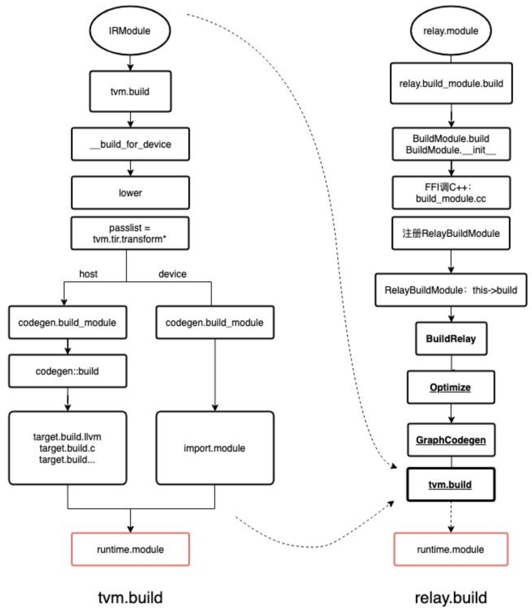

## Build

**tvm.build针对单一算子**
**relay.build针对整个模型进行编译**

relay.build后期会调用到tvm.build做代码生成



### IR变换「优化」

**IRModule**是functions的集合，其中包含两种最关键的Function集合：

- **relay::Function**是高级功能程序表示。 relay.Function通常对应于端到端模型。可以将relay看为一种计算图，并具有对控制流，递归和复杂数据结构的支持。**「计算图」**
- **tir::PrimFunc**是一个低层次程序表示，其中包含一些元素，包括循环嵌套选择，多维加载/存储，线程和向量/张量指令。 它通常用于表示在模型中执行（可能是融合的）层的op。**「具体的op」**

编译期间，一个真实的模型会被表达成一个高层次的relay::Function，同时这个relay::Function会被表达为一些列tir::PrimFunc的调用

#### relay/transform

relay/transform包含了许多**图级别pass**

在图变换的后期，会进行**子图切分**，也就是将端到端的func（MobileNet）切分为多个sub-function，这给进一步在子图内进行优化和构造执行的结构（execution structure）有好处。

经过图变换之后，随后将使用低级的TIR阶段来编译和优化每个子功能。 对于某些特定后端，也可以不走TIR，而直接进入目标翻译阶段并使用外部代码生成器。

将在**relay/backend**层做execution structure的调用，**这里会分为几种情况**：

1. **如果模型是静态shape、没有控制流，就lowering到graph runtime**

2. **如果模型是动态shape、有控制流，可以使用**  
   **virtual machine backend；**  

3. **还可以走AOT模式的编译，直接把子图级别的程序转换为executable and generated primitive functions的级别**。

上述提到的三种模式都会封装为一个统一的接口：**runtime.Module**

#### tir/transform

这个集合主要包括TIR级别的各种变换pass，这部分主要功能是lowering，当然也有一些optimization。

比如将访问多维数据扁平化为一维指针访问、针对特定的后端进行intrinsics扩展、或者根据运行时调用约定装饰函数（方便后续call）；注意这个阶段保留了一些底层优化没有做，而是交给了下游的LLVM或者CUDA C编译器来进行，比如寄存器分配等等；

### Target translation

本阶段就是将底层的IR进一步转换为目标后端对应的可执行文件

对于X86和ARM来说，TVM将使用**LLVM IR Builder**在内存中构建llvm ir；也可以生成源代码级别的语言，比如生成CUDA C或者OpenCL源码；

还支持直接从Relay Function（许多函数子图）到特定后端的codegen（要使用对应的codegen手段，这样就跳过TIR的变换阶段了）

这里TVM提到：最后的codegen阶段的任务应该越简洁、越轻量越好，相关的代码优化应该在这个阶段之前就做好了。

### Runtime execution

之前的所有阶段，编译完毕后可以生成一个[tvm.runtime.Module](https://tvm.apache.org/docs/reference/api/python/runtime.html#tvm.runtime.Module)，除此之外还有一个利器，就是[tvm.runtime.PackedFunc](https://tvm.apache.org/docs/reference/api/python/runtime.html#tvm.runtime.PackedFunc)接口，它提供了一个类型擦除的函数式转换工具，可以接受或者返回以下类型的对象：POD types(int, float), string, runtime.PackedFunc, runtime.Module, runtime.NDArray, and other sub-classes of runtime.Object.

有了这两个接口，就可以轻松实现：首先使用LLVM来生成某个CUDA代码的主机端代码，并计算启动参数，然后使用packedFunc接口打包CUDAModule来进行设备端的调用；

### relay.build

高层逻辑：

1. **通过查询op注册表来查找op实现**
2. **为op生成计算表达式和调度**
3. **将op编译为目标代码**

#### 准备工作

`relay.build()`函数会进入`python/tvm/relay/build_module.py`，首先判断有没有autotvm预先tune好记录，然后构造tophub_context。

TVM官方提供了一部分预先调好的优化参数，存放在一个缓冲目录中，如果你恰巧在对应设备上使用了对应的运算，那么就可以直接复用参数。一般来说，这些参数会存放在`~/.tvm/tophub/`下。

文件里面说明了 "# This is the pre-tuned parameters for x86 cpu backend. TVM downloaded this during compilation"


```python
if isinstance(autotvm.DispatchContext.current, autotvm.FallbackContext):
    tophub_context = autotvm.tophub.context(list(raw_targets))
else:
    tophub_context = autotvm.utils.EmptyContext()
```

在其内部构建了BuildModule之后，才跳转到BuildModule.build，然后返回BuildModule.__init__中的内容

```python
with tophub_context:
    bld_mod = BuildModule()
    graph_json, runtime_mod, params = bld_mod.build(
        some_args...
    )
```

```python
class BuildModule(object):
    """Build an IR module to run on TVM graph executor. This class is used
    to expose the `RelayBuildModule` APIs implemented in C++.
    """

    def __init__(self):
        # 将会进入c++层
        self.mod = _build_module._BuildModule()
        ...some init...
```

```python
tvm._ffi._init_api("relay.build_module", __name__)
```

c++函数位于`src/relay/backend/build_module.cc`

```c++
TVM_REGISTER_GLOBAL("relay.build_module._BuildModule").set_body([](TVMArgs args, TVMRetValue* rv) {
  *rv = RelayBuildCreate();
});
runtime::Module RelayBuildCreate() {
  auto exec = make_object<RelayBuildModule>();
  return runtime::Module(exec);
}
```

这里注册了RelayBuildCreate，RelayBuildCreate下面还使用了PackedFunc做了一层封装（即RelayBuildModule）

```c++
// python的__getitem__应该被重写了
// 调用的时候都会来到这里依据函数名获取函数
PackedFunc GetFunction(const std::string& name, const ObjectPtr<Object>& sptr_to_self) final {
  ...
  else if (name == "build") {
        return PackedFunc([sptr_to_self, this](TVMArgs args, TVMRetValue* rv) {
          ICHECK_EQ(args.num_args, 8);
          this->Build(args[0], args[1], args[2], args[3], args[4], args[5], args[6], args[7]);
        });
  ...
}
```

python中调用的bld_mod.build会再去调用c++中的`RelayBuildModule::build`，接着会调用 BuildRelay


```c++
void Build(IRModule mod, const Array<Target>& raw_targets, const tvm::Target& target_host,
            const Executor& executor, const Runtime& runtime,
            const WorkspaceMemoryPools& workspace_memory_pools,
            const ConstantMemoryPools& constant_memory_pools, const String mod_name) {

    ...

    BuildRelay(std::move(mod), mod_name);
    }
```

#### 核心

下面的 BuildRelay 是核心模块，做了如下工作

1. 优化

2. 计算图生成

3. 后端代码生成
   
```c++
/*!
* \brief Compile a Relay IR module to runtime module.
*
* \param relay_module The Relay IR module.
* \param params The parameters.
*/
void BuildRelay(IRModule relay_module, const String& mod_name) {
  // Relay IRModule -> IRModule optimizations.
  
  IRModule module = WithAttrs(
      relay_module, {{tvm::attr::kExecutor, executor_}, {tvm::attr::kRuntime, runtime_}});
  1. 执行图级优化。里面会添加一系列graph级别pass
  relay_module = OptimizeImpl(std::move(module));
  
  // 获取更新的函数和新的 IRModule 来构建。
  // 与其重新创建 IRModule，不如查看它与传入的 IRModule 之间的区别，
  // 看看我们是否可以将 (IRModule, Function) 传递给代码生成器。
  2. 希望对IRModule做增量编译,而不是全部重新编译
  Function func = Downcast<Function>(relay_module->Lookup("main"));
  IRModule func_module = WithAttrs(IRModule::FromExpr(func),
                                    {{tvm::attr::kExecutor, executor_},
                                    {tvm::attr::kRuntime, runtime_},
                                    {tvm::attr::kWorkspaceMemoryPools, workspace_memory_pools_},
                                    {tvm::attr::kConstantMemoryPools, constant_memory_pools_}});
  
  // Generate code for the updated function.
  3. 计算图生成。判断是生成 GraphCodegen 还是 AOTCodegen
  executor_codegen_ = MakeExecutorCodegen(executor_->name);
  executor_codegen_->Init(nullptr, config_->primitive_targets);
  4. 对找到的main函数生成代码
  executor_codegen_->Codegen(func_module, func, mod_name);
  executor_codegen_->UpdateOutput(&ret_);
  ret_.params = executor_codegen_->GetParams();
  5. 获得 lowered_funcs
  auto lowered_funcs = executor_codegen_->GetIRModule();
  
  // No need to build for external functions.
  Target ext_dev("ext_dev");
  if (lowered_funcs.find(ext_dev) != lowered_funcs.end()) {
    lowered_funcs.Set(ext_dev, IRModule());
  }
  
  const Target& host_target = config_->host_virtual_device->target;
  const runtime::PackedFunc* pf = runtime::Registry::Get("codegen.LLVMModuleCreate");
  // When there is no lowered_funcs due to reasons such as optimization.
  if (lowered_funcs.size() == 0) {
    if (host_target->kind->name == "llvm") {
      CHECK(pf != nullptr) << "Unable to create empty module for llvm without llvm codegen.";
      // If we can decide the target is LLVM, we then create an empty LLVM module.
      ret_.mod = (*pf)(host_target->str(), "empty_module");
    } else {
      // If we cannot decide the target is LLVM, we create an empty CSourceModule.
      // The code content is initialized with ";" to prevent complaining
      // from CSourceModuleNode::SaveToFile.
      ret_.mod = tvm::codegen::CSourceModuleCreate(";", "", Array<String>{});
    }
  } else {
    6. 打包tir运行时
    ret_.mod = tvm::TIRToRuntime(lowered_funcs, host_target);
  }
  
  auto ext_mods = executor_codegen_->GetExternalModules();
  ret_.mod = tvm::codegen::CreateMetadataModule(ret_.params, ret_.mod, ext_mods, host_target,
                                                runtime_, executor_,
                                                executor_codegen_->GetExecutorCodegenMetadata());
  // Remove external params which were stored in metadata module.
  for (tvm::runtime::Module mod : ext_mods) {
    auto pf_var = mod.GetFunction("get_const_vars");
    if (pf_var != nullptr) {
      7. 删除常量
      Array<String> variables = pf_var();
      for (size_t i = 0; i < variables.size(); i++) {
        auto it = ret_.params.find(variables[i].operator std::string());
        if (it != ret_.params.end()) {
          VLOG(1) << "constant '" << variables[i] << "' has been captured in external module";
          ret_.params.erase(it);
        }
      }
    }
  }
}
```

##### 优化

**不断往pass_seqs里面塞各种优化pass**
这里的优化主要是**设备无关的优化**，是graph-level的针对tensor运算的优化。

比如：
* **去除公共子表达式**
  EliminateCommonSubexpr，分支卷积优化：CombineParallelConv2D，常量传播优化：...
* **规范化**
  将一些特殊运算转换成等价的常规算子运算，主要就是bias_add 转换为 expand_dim + broadcast_add
* **layout 变换和常量传播**
* **图融合优化**
  其优化内容几乎与 NNVM 一样，都是基于算子的 pattern (kElemWise, kBroadcast,kInjective, kCommReduce, kOutEWiseFusable, kOpaque)和融合规则 rule (kUknown, kFuseToMaster, kRealize)来运行融合算法的，可以参考一篇关于NNVM的文章，这里不再赘述。

```c++
// BuildRelay 中的 relay_module = OptimizeImpl(std::move(module));
IRModule OptimizeImpl(IRModule relay_module) {
  ICHECK(relay_module.defined()) << "The IRModule must be defined for the Relay compiler.";

  backend::BindParamsInModule(relay_module, params_);
  1. 初始化 Array<Pass>
  Array<Pass> pass_seqs =
      GetPassPrefix(/*is_homogenous=*/config_->primitive_targets.size() == 1, /*is_vm=*/false);
  transform::PassContext pass_ctx = PassContext::Current();

  if (config_->optional_homogeneous_target.defined()) {
    // This pass currently only supports the homogeneous case.
    pass_seqs.push_back(transform::SplitArgs(
        config_->optional_homogeneous_target->GetAttr<Integer>("max_function_args", -1)
            .value()
            .IntValue()));
  }

  // Always plan devices so the remaining passes don't need to distinguish homogeneous vs
  // hetrogenous execution.
  pass_seqs.push_back(transform::PlanDevices(config_));

  // Fuse the operations if it is needed.
  pass_seqs.push_back(transform::FuseOps());

  // Create a sequential pass and perform optimizations.
  2. 创建 sequential pass
  transform::Pass seq = transform::Sequential(pass_seqs);
  if (config_->optional_homogeneous_target.defined()) {
    With<Target> tctx(config_->optional_homogeneous_target);
    relay_module = seq(relay_module);
  } else {
    relay_module = seq(relay_module);
  }

  // Do layout rewrite for auto-scheduler.
  if (backend::IsAutoSchedulerEnabled() && config_->optional_homogeneous_target.defined()) {
      ...
    }
  }
  // do layout rewrite for metaschedule
  if (backend::IsMetaScheduleEnabled() && config_->optional_homogeneous_target.defined()) {
      ...
    }
  }

  relay_module = transform::InferType()(relay_module);

  // Inline the functions that have been lifted by the module scope.
  relay_module = transform::Inline()(relay_module);
  relay_module = transform::InferType()(relay_module);
  relay_module = transform::LabelOps()(relay_module);
  relay_module = transform::AnnotateMemoryScope(config_)(relay_module);

  ICHECK(relay_module.defined());

  return relay_module;
}
```

可以看到对于 ansor 以及 metaschedule 是需要添加一些特别的 pass 的

##### 计算图生成

``BuildRelay`` 函数中有下面几行代码

```c++
    // Generate code for the updated function.
    // 计算图生成。判断是生成 GraphCodegen 还是 AOTCodegen
    executor_codegen_ = MakeExecutorCodegen(executor_->name);
    executor_codegen_->Init(nullptr, config_->primitive_targets);
    executor_codegen_->Codegen(func_module, func, mod_name);
```

``executor_codegen`` 的类型可能是 ``GraphCodegen`` 也可能是 ``AOTCodegen``

下面按照 GraphCodegen 的类型进行分析

调用 ``executor_codegen_->Codegen(func_module, func, mod_name);`` -> ``ExecutorCodegen::Codegen`` -> ``relay.build_module._GraphExecutorCodegen`` -> ``CreateGraphCodegenMod`` -> ``GraphExecutorCodegenModule`` 

下面给出 ``GraphExecutorCodegenModule`` 的代码

```c++
class GraphExecutorCodegenModule : public runtime::ModuleNode {
 public:
  GraphExecutorCodegenModule() {}
  virtual PackedFunc GetFunction(const std::string& name, const ObjectPtr<Object>& sptr_to_self) {
    if (name == "init") {
      return PackedFunc([sptr_to_self, this](TVMArgs args, TVMRetValue* rv) {
        ICHECK_EQ(args.num_args, 2) << "The expected of arguments are: "
                                    << "runtime::Module mod and Array<Target> targets";
        void* mod = args[0];
        Array<Target> targets = args[1];
        codegen_ = std::make_shared<GraphExecutorCodegen>(reinterpret_cast<runtime::Module*>(mod),
                                                          std::move(targets));
      });
    } else if (name == "codegen") {
      // 在这里进行调用
      return PackedFunc([sptr_to_self, this](TVMArgs args, TVMRetValue* rv) {
        IRModule mod = args[0];
        Function func = args[1];
        String mod_name = args[2];
        this->output_ = this->codegen_->Codegen(mod, func, mod_name);
      });
    } 
    ...
  }

  const char* type_key() const final { return "RelayGraphExecutorCodegenModule"; }

 private:
  std::shared_ptr<GraphExecutorCodegen> codegen_;
  LoweredOutput output_;
};
```

当调用``codegen``时 -> ``GraphExecutorCodegen->Codegen`` 代码如下

遍历 relay::Function func，然后生成计算图。

内存分配：由函数`relay.backend.GraphPlanMemory`实现；`src/relay/backend/graph_plan_memory.cc`

`VisitExpr`对节点进行遍历并进行节点信息的记录。

`LowerExternalfunctions`完成ir节点到tir节点的转化以及schedule的优化。

[细节参考](https://zhuanlan.zhihu.com/p/339566528)

```c++
LoweredOutput Codegen(IRModule mod, relay::Function func, String mod_name) {
    mod_name_ = mod_name;
    // 为func分配内存
    memory_plan_ = GraphPlanMemory(func);
    backend::FunctionInfo func_info;
    if (memory_plan_.defined()) {
      // 使用新的内存分配更新mod工作空间大小
      func_info =
          relay::tec::UpdateMainWorkspaceSize(mod, config_, memory_plan_->expr_to_storage_info);
      mod = WithAttr(mod, "main_func_info", func_info);
    }
    // 将模型的relay ir形式转换为tensor表达式形式
    IRModule lowered_mod = tec::LowerTE(mod_name_, config_, [this](BaseFunc func) {
      // We need to maintain the constant map for external
      // functions so we pass this processing function which
      // allows us to process each function as we lower it.
      if (func->GetAttr<String>(attr::kCompiler).defined()) {
        UpdateConstants(func, &params_);
      }
      // 更新函数的元数据
      tec::UpdateFunctionMetadata(func, this->function_metadata_);
    })(mod);

    Optional<backend::FunctionInfo> main_func_info =
        lowered_mod->GetAttr<backend::FunctionInfo>("main_func_info");

    function_metadata_.Set(runtime::symbol::tvm_module_main, main_func_info.value());
    // 从模型的张量表达中找到main函数
    Function lowered_main_func = Downcast<Function>(lowered_mod->Lookup("main"));

    // Now that we have lowered all operators to TIR code, we can proceed with compilation.
    // We need to unfortunately re-plan as the previous results have been invalidated by lowering
    // we will fix this in future refactors.
    memory_plan_ = GraphPlanMemory(lowered_main_func);
    // The graph planner also can not handle planning calls to global variables to we must remap
    // First we convert all the parameters into input nodes.
    // 对低级化后的main的每个参数,加入var_map_表中
    for (auto param : lowered_main_func->params) {
      auto node_ptr = GraphInputNode::make_node_ptr(param->name_hint(), GraphAttrs());
      var_map_[param.get()] = AddNode(node_ptr, param);
    }
    // 遍历模型函数的每个节点,将其转换化为json格式
    heads_ = VisitExpr(lowered_main_func->body);
    std::ostringstream os;
    // 写json文件
    dmlc::JSONWriter writer(&os);
    GetJSON(&writer);
    LoweredOutput ret;
    ret.graph_json = os.str();

    // Collect any runtime modules generated by external codegen.
    // 收集外部代码生成器生成的运行时模块
    ret.external_mods =
        lowered_mod->GetAttr<Array<runtime::Module>>(tvm::attr::kExternalMods).value_or({});

    // Collect any constants extracted by external codegen.
    ret.params = std::unordered_map<std::string, tvm::runtime::NDArray>();
    Map<String, runtime::NDArray> const_name_to_constant =
        lowered_mod->GetAttr<Map<String, runtime::NDArray>>(tvm::attr::kConstNameToConstant)
            .value_or({});
    for (const auto& kv : const_name_to_constant) {
      VLOG(1) << "constant '" << kv.first << "' contributed by external codegen";
      ICHECK(ret.params.emplace(kv.first, kv.second).second);
    }

    // Collect any constants extracted during lowering.
    for (const auto& kv : params_) {
      VLOG(1) << "constant '" << kv.first << "' contributed by TECompiler";
      ICHECK(ret.params.emplace(kv.first, kv.second).second);
    }

    ret.function_metadata = std::move(function_metadata_);

    // This is the point where we separate the functions in the module by target
    // 按target分离device和host模块
    ret.lowered_funcs = tec::GetPerTargetModules(lowered_mod);
    ret.metadata =
        ExecutorCodegenMetadata({} /* inputs */, {} /* input_tensor_types */, {} /* outputs */,
                                {} /* output_tensor_types */, {} /* pools */, {} /* devices */,
                                runtime::kTvmExecutorGraph /* executor */, mod_name_ /* mod_name */,
                                "packed" /* interface_api */, Bool(false) /* unpacked_api */);
    return ret;
  }
```


[关于VisitExpr](./visitexpr.md)


##### 后端代码生成

Relay得到lower后的函数，将做后端代码生成，跳转到`src/driver/driver_api.cc`中的TIRToRuntime函数（注意这里重载了多种实现），然后跳转到核心build，这里的build函数支持异构编译，需要在inputs划分好不同硬件设施。
（其实不是很清楚怎么跳转到这个函数的）

```c++
runtime::Module TIRToRuntime(const Map<Target, IRModule>& inputs_arg,
                             const Target& target_host_arg) {
  auto pass_ctx = transform::PassContext::Current();

  std::vector<runtime::Module> device_modules;
  Map<Target, IRModule> inputs = inputs_arg;
  Target target_host = target_host_arg;

  // Fetch previous defined target host in targets
  CheckAndUpdateHostConsistency(&inputs, &target_host);

  if (!target_host.defined()) {
    for (const auto& it : inputs) {
      if (it.first->kind->device_type == kDLCPU || it.first->kind->device_type == kDLMicroDev) {
        target_host = it.first;
        break;
      }
    }
  }

  if (!target_host.defined()) {
    target_host = DefaultTargetHost(target_host);
  }

  // Update target host for all targets
  CheckAndUpdateHostConsistency(&inputs, &target_host);

  // Take the attrs from the first module so the eventual modules have them.
  // Ideally this would just be one unified module all the way through;
  IRModule first_module = (*inputs.begin()).second;
  IRModule mhost_all = IRModule(Map<GlobalVar, BaseFunc>(), {}, {}, {}, first_module->attrs);

  ICHECK(mhost_all.defined()) << "The host module must be defined";

  for (const auto& it : inputs) {
    if (it.second.defined()) {
      const Target& target = it.first;
      const IRModule& ir_module = it.second;
      auto pair = SplitMixedModule(ir_module, target, target_host);
      auto& host_mod = pair.first;
      auto& device_mod = pair.second;

      ICHECK(host_mod.defined()) << "The split host module must be defined";

      ICHECK(mhost_all.defined()) << "The host module must be defined";

      // We don't want library modules going back into host codegen
      // unless they're supposed to. Here if we overrode the target host
      // to allow lowering previously we check that it's meant to be placed
      // back into the host Module.
      bool overrides_host_target = target->kind->device_type == target_host->kind->device_type;
      bool non_host_target_kind = target->kind != target_host->kind;
      if (overrides_host_target && non_host_target_kind) {
        device_modules.push_back(codegen::Build(host_mod, it.first));
      } else {
        mhost_all->Update(host_mod);
      }

      if (device_mod->functions.size() != 0) {
        device_modules.push_back(codegen::Build(device_mod, it.first));
      }
    }
  }

  runtime::Module mhost = codegen::Build(mhost_all, target_host);
  for (const auto& it : device_modules) {
    if (it.operator->()) {
      mhost.Import(it);
    }
  }

  return mhost;
}
```

当中最最核心的则是mhost = codegen::Build，最后跳转过去就开始调用代码生成模块了（src/target/codegen.cc）。

```c++
runtime::Module Build(IRModule mod, Target target) {
  if (transform::PassContext::Current()
          ->GetConfig<Bool>("tir.disable_assert", Bool(false))
          .value()) {
    mod = tir::transform::SkipAssert()(mod);
  }

  auto target_attr_map = tvm::TargetKind::GetAttrMap<FTVMTIRToRuntime>("TIRToRuntime");
  if (target_attr_map.count(target->kind)) {
    return target_attr_map[target->kind](mod, target);
  }

  // the build function.
  std::string build_f_name = "target.build." + target->kind->name;
  const PackedFunc* bf = runtime::Registry::Get(build_f_name);
  ICHECK(bf != nullptr) << build_f_name << " is not enabled";
  return (*bf)(mod, target);
}
```

以生成LLVM IR为例，`codegen.build_llvm`会在src/runtime/registry.cc注册，然后调用到src/target/llvm/codegen_llvm.cc中的`LLVMModuleNode->Init`。这时会跳转到src/codegen/llvm/codegen_llvm.cc中的`CodeGenLLVM`类进行代码生成。

[参考](https://zhuanlan.zhihu.com/p/381691430)


c++ 中的代码跑完了后，继续回到 python 的 build_module.py 中

```python
elif executor.name == "graph":
    executor_factory = _executor_factory.GraphExecutorFactoryModule(
        ir_mod,
        raw_targets,
        executor,
        graph_json,
        runtime_mod,
        mod_name,
        params,
        func_metadata,
    )
```

进入到 GraphExecutorFactoryModule 中

```python
    assert isinstance(graph_json_str, string_types)
    fcreate = get_global_func("tvm.graph_executor_factory.create")
    ...
    self.module = fcreate(graph_json_str, libmod, libmod_name, *args)
    ...
```

在 src/runtime/graph_executor/graph_executor_factory.cc 中注册这个函数

```c++
TVM_REGISTER_GLOBAL("tvm.graph_executor_factory.create")
    .set_body([](TVMArgs args, TVMRetValue* rv) {
      ICHECK_GE(args.num_args, 3) << "The expected number of arguments for "
                                     "graph_executor_factory.create needs at least 3, "
                                     "but it has "
                                  << args.num_args;
      // The argument order is graph_json, module, module_name, param0_name, param0_tensor,
      // [param1_name, param1_tensor], ...
      ICHECK_EQ((args.size() - 3) % 2, 0);
      std::unordered_map<std::string, tvm::runtime::NDArray> params;
      // 参数不止这些，利用map存多个参数
      for (size_t i = 3; i < static_cast<size_t>(args.size()); i += 2) {
        std::string name = args[i].operator String();
        params[name] = args[i + 1].operator tvm::runtime::NDArray();
      }
      auto exec = make_object<GraphExecutorFactory>(args[0], params, args[2]);
      exec->Import(args[1]);
      *rv = Module(exec);
    });
```

```c++
GraphExecutorFactory::GraphExecutorFactory(
    const std::string& graph_json,
    const std::unordered_map<std::string, tvm::runtime::NDArray>& params,
    const std::string& module_name) {
  graph_json_ = graph_json;
  params_ = params;
  module_name_ = module_name;
}
```
