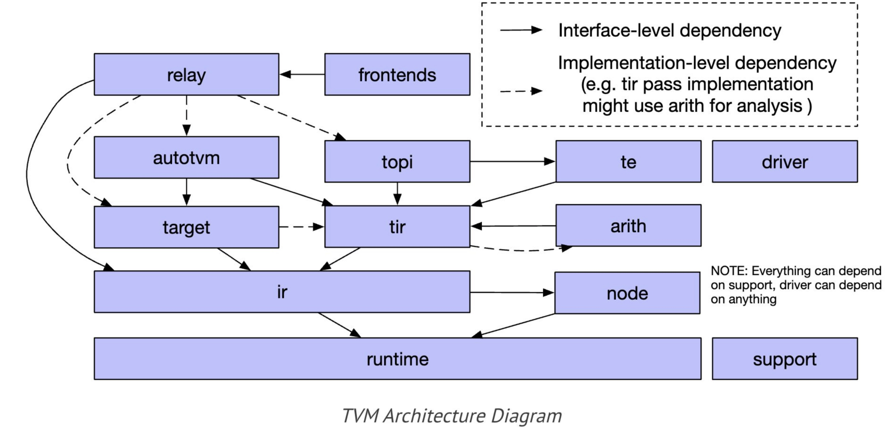
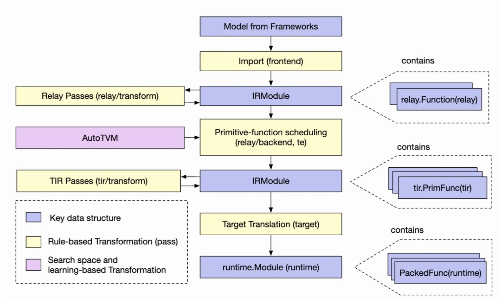

# 源码分析

## 框架图




## AutoTVM执行过程

```python
调用流程：
1 relay.frontend.from_pytorch(解析过程，略)
2 autotvm.task.extract_from_program(任务提取)
  2.1 _lower(收集task)
    2.1.1 optimize(优化过程，略)
    2.1.2 GraphExecutorCodegen.codegen
      2.1.2.1(调用链)->select_implementation
        2.1.2.1.1 get_valid_implementations(通过FTVMStrategy找到实现)
        2.1.2.1.2 fcompute -> register_topi_compute
          2.1.2.1.2.1 _register_task_compute(函数添加到TASK_TABLE中，生成了template)
          2.1.2.1.2.2 TaskExtractEnv.add_task(添加task)
  2.2 create(填充task信息)
    2.2.1 ApplyConfig(config_space)(设定默认config，用于记录解空间) && Task.func -> fcompute && fschedule(记录所有可能解)
    2.2.2 compute_flop(计算flop)
3 Tuner.tune(寻找解)
  3.1 create_measure_batch(创建评估函数)
    3.1.1 LocalRunner.set_task(初始化runner)
      3.1.1.1 Tracker.__init__(创建Tracker监听消息)
        3.1.1.1.1 _tracker_server -> TrackerServerHandler
        3.1.1.1.2 TrackerServerHandler.run(开始监听IO)
          3.1.1.1.2.1 _on_event->TCPEventHandler.on_message(事件处理)
            3.1.1.1.2.1.1 _init_conn(验证链接)
            3.1.1.1.2.1.2 call_handler -> ret_value(处理并回复)
      3.1.1.2 Server.__init__(创建Server监听消息)
        3.1.1.2.1 PopenWorker._start(创建tvm/exec/popen_worker.py子进程处理消息)
        3.1.1.2.2 _popen_start_rpc_server -> PopenRPCServerState -> _listen_loop(绑定监听线程)
          3.1.1.2.2.1 _listen_loop -> setup tracker(绑定tracker)
      3.1.1.3 check_remote(创建临时client并检查链接)
        3.1.1.3.1 connect_tracker(和tracker进行初始信息交互)
        3.1.1.3.2 TrackerSession.request(构建client并初始化session)
          3.1.1.3.2.1 sendjson && recvjson(获取tracker保存的key)
          3.1.1.3.2.2 _ffi_api.Connect交互(remote和server信息交互)
          3.1.1.3.2.3 RPCEndpoint::InitRemoteSession && ServerLoop -> HandleUntilReturnEvent -> HandleNextEvent (构建Remote链接和信息处理Loop)
    3.1.2 LocalBuilder.set_task(初始化builder)
  3.2 next_batch(取下一批数据) && measure_batch(评估得到结果)
    3.2.1 LocalBuilder.build(构建可执行的函数内核)
      3.2.1.1 LocalExecutor.submit -> _WrappedBuildFunc.__call__ -> _build_func_common -> tvm.driver.build(构建内核)
    3.2.2 LocalRunner.run(执行内核得到结果)
      3.2.2.1 module_loader(加载内核)
        3.2.2.1.1 request_remote(RPC链接)
        3.2.2.1.2 RPCSession.upload(使用tvm.rpc.server.upload保存lib)
          3.2.2.1.2.1.client RPCClientSession.GetFunction -> RPCEndpoint::SysCallRemote(获取函数)
          3.2.2.1.2.1.server HandleUntilReturnEvent -> HandleSyscall -> LocalSession::GetFunction(获取注册的函数)
          3.2.2.1.2.2.client RPCClientSession::CallFunc -> RPCEndpoint::CallFunc(调用函数)
          3.2.2.1.2.2.server HandleUntilReturnEvent -> HandleNormalCallFunc -> LocalSession::CallFunc(执行函数)
        3.2.2.1.3 RPCSession.load_module(使用tvm.rpc.server.load_module加载lib)
      3.2.2.2 mod.time_evaluator
        3.2.2.2.1 runtime.RPCTimeEvaluator(获取包裹的测试函数)
      3.2.2.3 random_fill
        3.2.2.3.1 get_function(获取函数)
        3.2.2.3.2 nd.array(构建原始数据)
          3.2.2.3.2.1 empty -> NDArray::Empty -> RPCDevAllocDataWithScope(开辟内存)
          3.2.2.3.2.2 copyfrom -> TVMArrayCopyFromBytes -> HandleCopyToRemote && HandleSyscallStreamSync(拷贝并同步)
        3.2.2.3.3 random_fill.__call__ -> RandomEngine::RandomFill(随即填充数据)
      3.2.2.4 dev.sync -> RPCSession::StreamSync -> HandleSyscallStreamSync(设备同步)
      3.2.2.5 time_f.__call__ -> WrapTimeEvaluator(执行测试，多次平均)
```

GridSearchTuner 也是一种调优器。继承关系：GridSearchTuner -> IndexBaseTuner -> Tuner
发现继承的子类似乎都只有获取数据的逻辑，在进行调优的时候，实际上用的都是Tuner类中的tune方法，也就是说调优的逻辑是相同的，只是获取数据的方式不同，这点算是比较好理解。


[参考](https://zhuanlan.zhihu.com/p/457722423)

[参考](https://www.zhihu.com/question/374117826/answer/2549192075)

## autotvm.apply_history_best()

在使用relay.build之前，通常都会有这么一句

```python
with autotvm.apply_history_best(log_file):
    print("Compile...")
    with tvm.transform.PassContext(opt_level=3):
        lib = relay.build(mod, target=target, params=params)
    evaluate_performance(lib, data_shape)
```

log_file 是之前 tune 得到的数据，~~我猜测这里应该是训练成本模型的地方~~ 似乎不是，他只是从里面选了一些数据出来
ApplyHistoryBest 在 init 时会调用 self.load(records)

接下来进入 PassContext()

```python
def __init__(
    self,
    opt_level=2,
    required_pass=None,
    disabled_pass=None,
    instruments=None,
    config=None,
):
    ...
    self.__init_handle_by_constructor__(
        _ffi_transform_api.PassContext, opt_level, required, disabled, instruments, config
    )
```

[Ansor](https://blog.csdn.net/jinzhuojun/article/details/121296836)