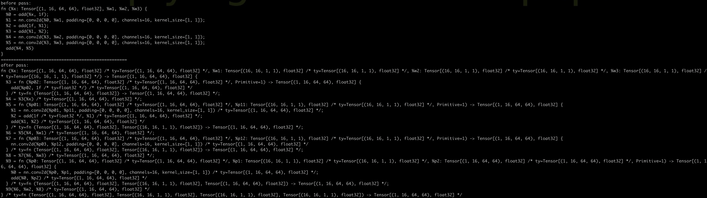
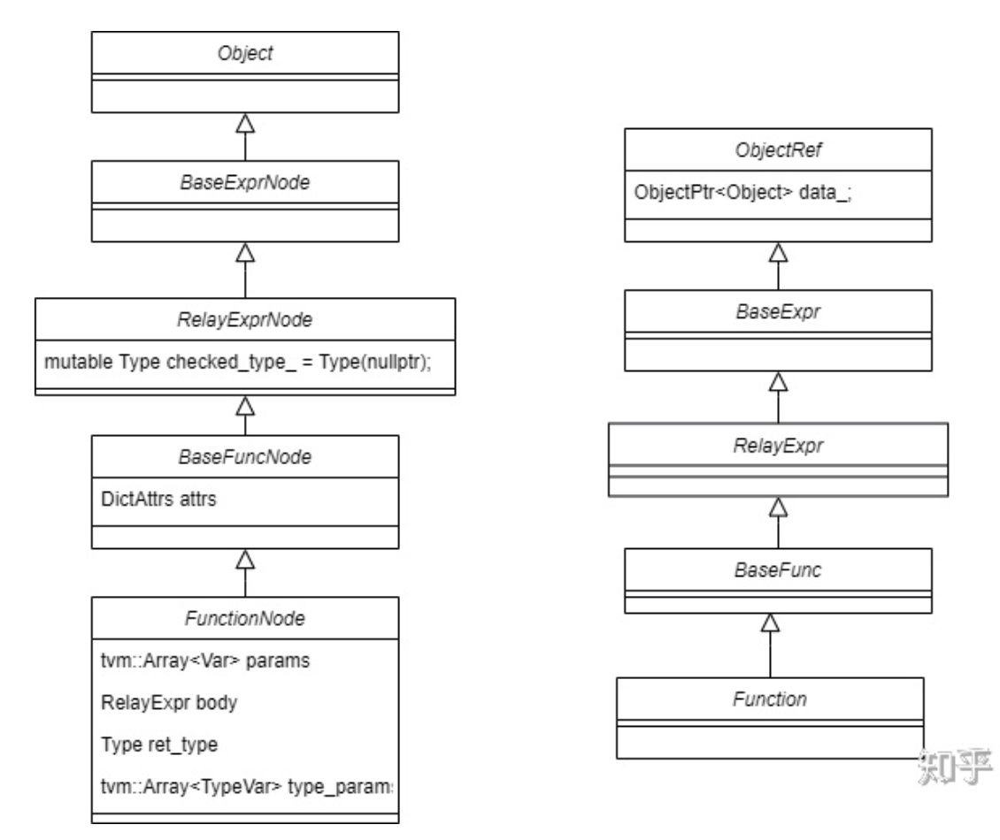
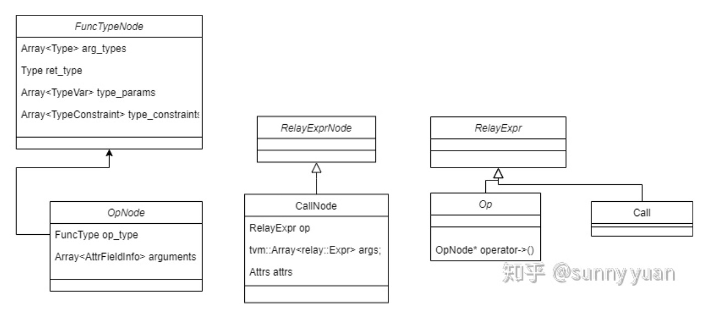
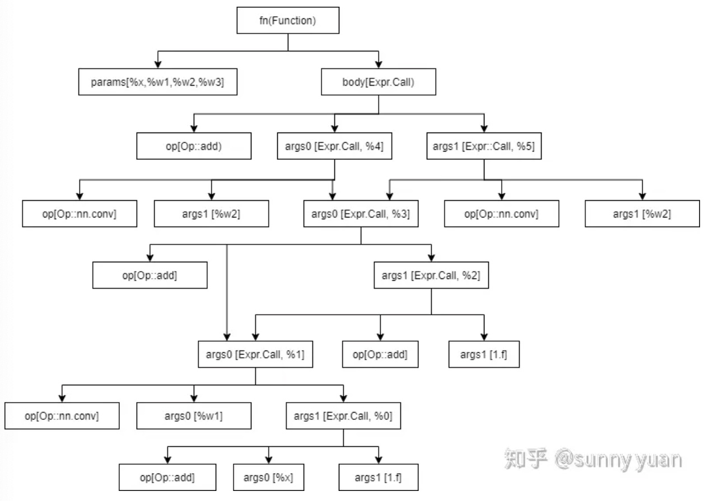
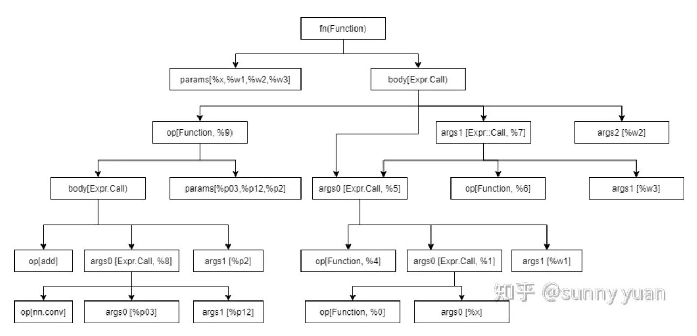

# visitor 设计模式以及在 tvm 中的应用

## visitor 设计模式
visitor 设计模式适用于未来需要添加新的 action 的情况。

### 为什么需要 visitor 设计模式

#### version 1
```c++
class Element {
    virtual void func1();
};
class ElementA : public Element {
    void func1() override {...}
};
class ElementB : public Element {
    void func1() override {...}
};
```

可以看到 `func1` 是一个虚函数，在面对不同的 class 的时候，会有不一样的行为。

#### version 2
当需要添加新的操作时，会这么写

```c++
class Element {
    virtual void func1();
    virtual void func2();
};
class ElementA : public Element {
    void func1() override {...}
    void func2() override {...}
};
class ElementB : public Element {
    void func1() override{...}
    void func2() override {...}
};
```

问题：
1. 每添加一个新的 operation 都需要对所有的子类进行修改。但是在一些场景下，可能具有上百种子类（比如说算子），那么一旦我们需要添加新的 operation ，就需要手动修改这上百种子类中的虚函数。而且这些 operation 可能会频繁的修改，因此采用这种写法手动维护的工作量是非常大的。
2. 违反了设计模式的开闭原则。对于已经设计好的数据结构，不应该再去修改里面的值

### visitor 设计模式怎么写

#### version 3

```c++
class Visitor;

class Element {
    virtual void accept(Visitor& visitor) = 0;
};
class ElementA : public Element {
    void accept(Visitor& visitor) override {
        visitor.visitElementA(*this);
    }
};
class ElementB : public Element {
    void accept(Visitor& visitor) override {
        visitor.visitElementB(*this);
    }
};
class Visitor {
    virtual void visitElementA(ElementA& element) = 0;
    virtual void visitElementB(ElementB& element) = 0;
};

// 接下来看看如何添加新的操作

class Visitor1 : public Visitor {
    void visitElementA(ElementA& element) override {
        std::cout << "Visit1_ElementA" << std::endl;
    }
    void visitElementB(ElementB& element) override {
        std::cout << "Visit1_ElementB" << std::endl;
    }
}
// 此时，我们就相当于新添加了操作
class Visitor2 : public Visitor {
    void visitElementA(ElementA& element) override {
        std::cout << "Visit2_ElementA" << std::endl;
    }
    void visitElementB(ElementB& element) override {
        std::cout << "Visit2_ElementB" << std::endl;
    }
}

int main() {
    Visitor2 visitor;
    ElementB element;
    element.accept(visitor); // double dispatch
    // print Visit2_ElementB
}
```

如果说以后还需要添加新的 operation ，那么只需要新建一个 `VisitorX` 就可以了。这样，可维护性将大大提升。

但是，使用 visitor 模式，有一个很重要的前提，就是子类需要确定下来。假如添加了一个新的子类，那么就需要反过头去在每一个 Visitor 当中添加针对新子类的 operation。

## 在编译器中应用

在得到 AST 树以后，会对 AST 树进行 dfs，每一个树节点就是上面的 Element，node 之间存在继承关系。node 的种类和数量通常是固定的，但是可能新增一些 opeartion (pass)。这种场景就非常适合使用 Visitor 设计模式。

## 在 tvm 中的应用

不同框架保存的模型，使用的数据结构是不一样的，在导入 tvm 时，会把他们都转换为 Relay IR。然后再基于 Relay IR 进行优化以及 codegen 相关的工作。

下面是使用 Relay IR 搭建的小模型
```python
from tvm import te
from tvm import relay
from tvm.relay import transform
from tvm.relay.testing import run_opt_pass
import tvm.testing
import numpy as np
import tvm
dshape = (1, 16, 64, 64)
x = relay.var("x", shape=dshape)
x = relay.add(x, relay.const(1, "float32"))
y = relay.nn.conv2d(x, relay.var("w1"), kernel_size=(1, 1), padding=(0, 0), channels=16)
y1 = relay.add(relay.const(1, "float32"), y)
y = relay.add(y, y1)
z2 = relay.nn.conv2d(y, relay.var("w2"), kernel_size=(1, 1), padding=(0, 0), channels=16)
z3 = relay.nn.conv2d(y, relay.var("w3"), kernel_size=(1, 1), padding=(0, 0), channels=16)
z = relay.add(z2, z3)

func = relay.Function(relay.analysis.free_vars(z), z)
print("before pass: ")
print(func)

print("="*50)

func = run_opt_pass(func, transform.FuseOps(fuse_opt_level=2))
print("after pass: ")
print(func)
```



### before pass
```python
fn (%x: Tensor[(1, 16, 64, 64), float32], %w1, %w2, %w3) {
  %0 = add(%x, 1f);
  %1 = nn.conv2d(%0, %w1, padding=[0, 0, 0, 0], channels=16, kernel_size=[1, 1]);
  %2 = add(1f, %1);
  %3 = add(%1, %2);
  %4 = nn.conv2d(%3, %w2, padding=[0, 0, 0, 0], channels=16, kernel_size=[1, 1]);
  %5 = nn.conv2d(%3, %w3, padding=[0, 0, 0, 0], channels=16, kernel_size=[1, 1]);
  add(%4, %5)
}
```
如上所示是FuseOp pass之前的IR，可以看到它整体就是一个”函数“，它有输入的参数%x，%w1, %w2，%w3，它的主体（body)部分包含了一些列算子调用，对应了代码中的一系列add和conv，最后的返回值是add(%4,%5)的结果。 body部分的算子调用会有不同的类型，比如这儿有add, conv2d，不同的算子调用一般会有输入和输出，例如第一个add的输入是%x, 1.0f，输出是%0，可以认为就是%0=%x + 1。



上图是Relay中Function的类继承关系图。Function 继承自ObjectRef，数据成员data_就是FunctionNode类型的指针。可以看到FunctionNode 中包含params, body等数据成员，params即是输入的参数，body就是函数的主题部分，可以看到body的类型也是RelayExpr，后续可以了解到前面提到的算子调用[call]也是RelayExpr，这儿的body的类型就是Call。

事实上函数[function]和算子调用[call]是RelayIR中两个基本的数据结构。



上图是Call以及Op的数据结构。
- Relay中支持的算子，例如conv,add这些都会注册成为Relay中的Op对象，Op 中包含OpNode的指针，OpNode中包含了这些算子的信息。
- CallNode中包含op，args，attrs这些数据成员
  - 这儿的op的类型是RelayExpr，代表所要支持的操作类型，op可以是Op类型，具体可能是conv、add等等（注意区分这儿的op和Op，op是CallNode的成员变量，Op是类型），op甚至可能是Function（因为Function 也是RelayExpr的类型，后面会有实例来说明）。
  - args代表CallNode的输入，CallNode的输入类型是relay::Expr （也就是RelayExpr，TVM源码中有typedef RelayExpr relay::Expr;)，**这也就表示Call Node的输入可以是一个Call(Call 也是RelayExpr的数据类型）**，例如图1中的add3是一个Call节点，它的输入是conv1和add2，conv1和add2也都是Call节点。

以下是FuseOp pass 之前IR对应的AST(抽象语法树），可以帮助大家更好的理解Call数据结构。可以看到整个的IR是一个Function，包含params，和body两部分，其中body的属性是Call，body包含op, args部分，这儿的op是Op类型(具体操作是add），args的维度是2，都是Call。后续大家可以以此类推。



查看TVM源码中的FunctionNode定义（如下所示），可以看到其中关于VisitAttrs 函数的定义，例如v->Visit("params", &params) 就表示可以使用名字"params"来访问FunctionNode中的params成员变量。python代码中的func是Function类型（大家可以尝试用type(func)进行确认），func.body 会自动对func进行解引用取出Function中的data_（FunctionNode类型），并且访问FunctionNode的body成员变量。 以此类推，可以查看源码中其它类型数据中VisitAttrs函数的定义。

```c++
class FunctionNode : public BaseFuncNode {
 ...
  void VisitAttrs(tvm::AttrVisitor* v) {
    v->Visit("params", &params);
    v->Visit("body", &body);
    v->Visit("ret_type", &ret_type);
    v->Visit("type_params", &type_params);
    v->Visit("attrs", &attrs);
    v->Visit("span", &span);
    v->Visit("_checked_type_", &checked_type_);
  }
}
```

### after pass

因为大家看到的大多数会是经过pass之后的Relay IR，经过FuseOppass之后，IR会有较大的调整，下面是打印的FuseOp pass之后的IR。

```python
fn (%x: Tensor[(1, 16, 64, 64), float32] /* ty=Tensor[(1, 16, 64, 64), float32] */, %w1: Tensor[(16, 16, 1, 1), float32] /* ty=Tensor[(16, 16, 1, 1), float32] */, %w2: Tensor[(16, 16, 1, 1), float32] /* ty=Tensor[(16, 16, 1, 1), float32] */, %w3: Tensor[(16, 16, 1, 1), float32] /* ty=Tensor[(16, 16, 1, 1), float32] */) -> Tensor[(1, 16, 64, 64), float32] {
  %3 = fn (%p02: Tensor[(1, 16, 64, 64), float32] /* ty=Tensor[(1, 16, 64, 64), float32] */, Primitive=1) -> Tensor[(1, 16, 64, 64), float32] {
    add(%p02, 1f /* ty=float32 */) /* ty=Tensor[(1, 16, 64, 64), float32] */
  } /* ty=fn (Tensor[(1, 16, 64, 64), float32]) -> Tensor[(1, 16, 64, 64), float32] */;
  %4 = %3(%x) /* ty=Tensor[(1, 16, 64, 64), float32] */;
  %5 = fn (%p01: Tensor[(1, 16, 64, 64), float32] /* ty=Tensor[(1, 16, 64, 64), float32] */, %p11: Tensor[(16, 16, 1, 1), float32] /* ty=Tensor[(16, 16, 1, 1), float32] */, Primitive=1) -> Tensor[(1, 16, 64, 64), float32] {
    %1 = nn.conv2d(%p01, %p11, padding=[0, 0, 0, 0], channels=16, kernel_size=[1, 1]) /* ty=Tensor[(1, 16, 64, 64), float32] */;
    %2 = add(1f /* ty=float32 */, %1) /* ty=Tensor[(1, 16, 64, 64), float32] */;
    add(%1, %2) /* ty=Tensor[(1, 16, 64, 64), float32] */
  } /* ty=fn (Tensor[(1, 16, 64, 64), float32], Tensor[(16, 16, 1, 1), float32]) -> Tensor[(1, 16, 64, 64), float32] */;
  %6 = %5(%4, %w1) /* ty=Tensor[(1, 16, 64, 64), float32] */;
  %7 = fn (%p03: Tensor[(1, 16, 64, 64), float32] /* ty=Tensor[(1, 16, 64, 64), float32] */, %p12: Tensor[(16, 16, 1, 1), float32] /* ty=Tensor[(16, 16, 1, 1), float32] */, Primitive=1) -> Tensor[(1, 16, 64, 64), float32] {
    nn.conv2d(%p03, %p12, padding=[0, 0, 0, 0], channels=16, kernel_size=[1, 1]) /* ty=Tensor[(1, 16, 64, 64), float32] */
  } /* ty=fn (Tensor[(1, 16, 64, 64), float32], Tensor[(16, 16, 1, 1), float32]) -> Tensor[(1, 16, 64, 64), float32] */;
  %8 = %7(%6, %w3) /* ty=Tensor[(1, 16, 64, 64), float32] */;
  %9 = fn (%p0: Tensor[(1, 16, 64, 64), float32] /* ty=Tensor[(1, 16, 64, 64), float32] */, %p1: Tensor[(16, 16, 1, 1), float32] /* ty=Tensor[(16, 16, 1, 1), float32] */, %p2: Tensor[(1, 16, 64, 64), float32] /* ty=Tensor[(1, 16, 64, 64), float32] */, Primitive=1) -> Tensor[(1, 16, 64, 64), float32] {
    %0 = nn.conv2d(%p0, %p1, padding=[0, 0, 0, 0], channels=16, kernel_size=[1, 1]) /* ty=Tensor[(1, 16, 64, 64), float32] */;
    add(%0, %p2) /* ty=Tensor[(1, 16, 64, 64), float32] */
  } /* ty=fn (Tensor[(1, 16, 64, 64), float32], Tensor[(16, 16, 1, 1), float32], Tensor[(1, 16, 64, 64), float32]) -> Tensor[(1, 16, 64, 64), float32] */;
  %9(%6, %w2, %8) /* ty=Tensor[(1, 16, 64, 64), float32] */
} /* ty=fn (Tensor[(1, 16, 64, 64), float32], Tensor[(16, 16, 1, 1), float32], Tensor[(16, 16, 1, 1), float32], Tensor[(16, 16, 1, 1), float32]) -> Tensor[(1, 16, 64, 64), float32] */
```

可以看到现在IR当中，内部的算子调用都被封装成了Function，有的是单独一个算子调用被封装成了Function，有的是连续的几个算子调用被封装成了Function。图1中虚线框就表示封装的Function。几个算子调用融合在一起达到的效果是可以较少数据存取，提高性能。

%7是Call类型，它的args是%5和%w3，它的op是%6，这儿的op的类型就是Function。

如下面是FuseOp pass之后的AST。只拓展了Function %9，Function %6，%4，%0都没拓展开来，可以以此类推。



参考
https://zhuanlan.zhihu.com/p/339348734
https://www.youtube.com/watch?v=94dGLZZZV9o&list=PL2CzLRmpTZj3H1p-APQckEUNBbGgq7yAD&index=25